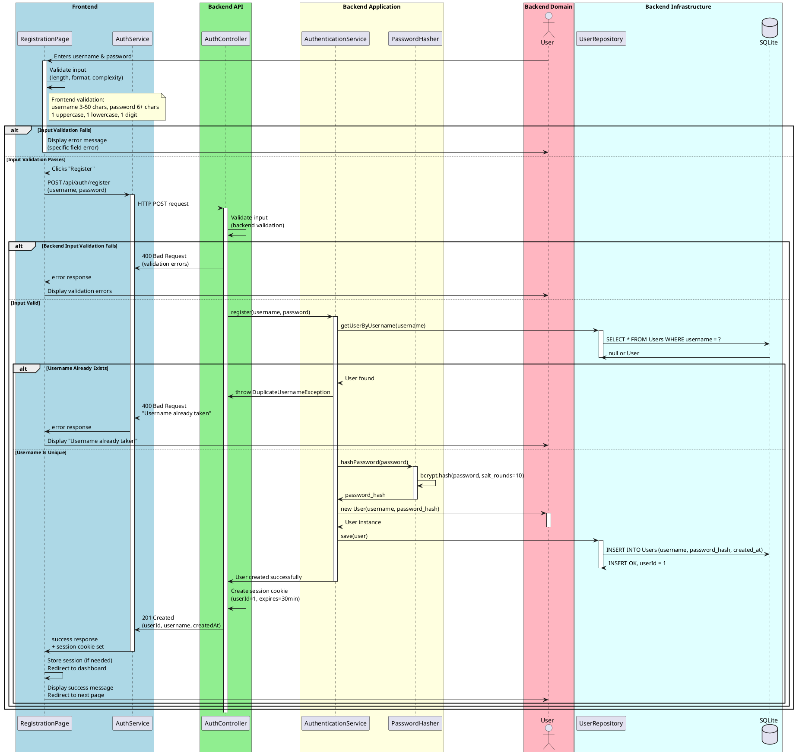
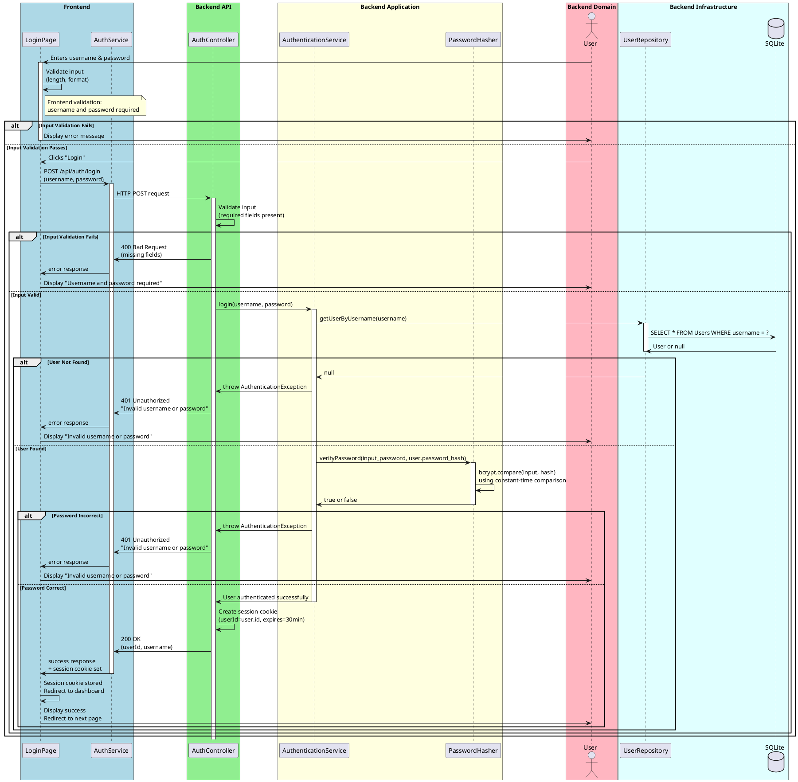
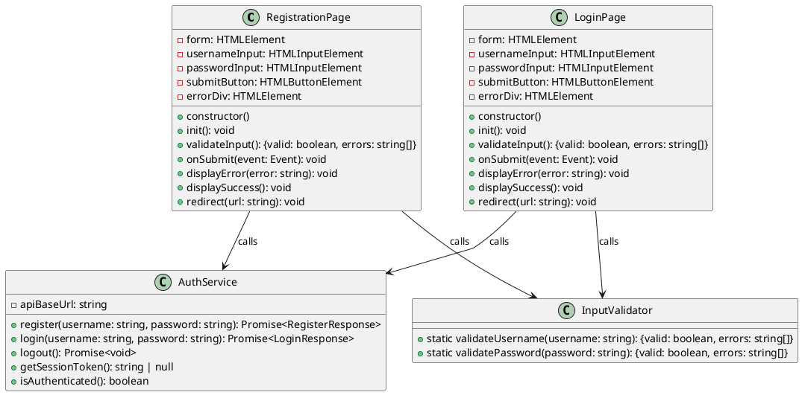
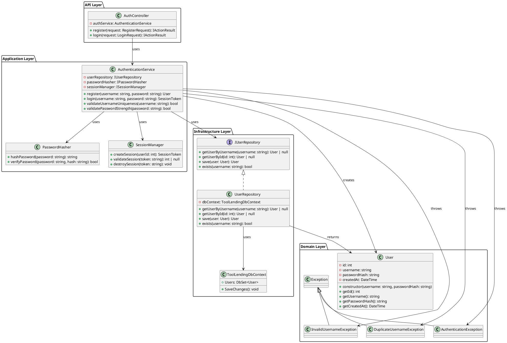
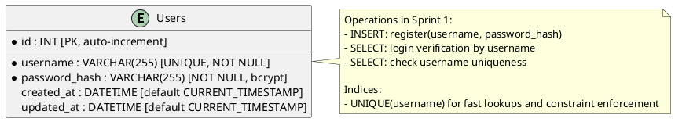

# Sprint 1 — Design Document
## UC-1: User Registration & UC-2: User Login
### Flows: BF1 (Register), BF2 (Login)

---

## 1. Sprint Scope

This sprint delivers the **authentication foundation** for the Tool Lending Platform: user registration and login.

| Flow ID | Description | Status |
|---------|-------------|--------|
| BF1 | User Registration | ✅ This sprint |
| BF2 | User Login | ✅ This sprint |

**Handoff Note:**  
Sprint 1 outputs the core authentication APIs and UI pages. Subsequent sprints (2–5) will build on these authenticated sessions to implement tool management and borrowing workflows. All future endpoints will assume a valid session/token from Sprint 1.

---

## 2. BCE → Design Element Mapping

### Design Decisions
- **Reuse**: AuthenticationService from Inception catalog; map to ASP.NET Core controller + C# service layer.
- **New Boundary**: RegistrationPage and LoginPage HTML/JS components.
- **New Entity**: User domain class with password hashing via bcrypt.
- **Session Management**: ASP.NET Core session cookies (simple, fits prototype scope).

---

### 2.1 Frontend Presentation Layer

| BCE Class | BCE Type | Design Element | Type | Responsibility |
|-----------|----------|----------------|------|-----------------|
| RegistrationBoundary | Boundary | registration.html | HTML Page | Form for username/password input; client-side validation; submit to API |
| LoginBoundary | Boundary | login.html | HTML Page | Form for username/password input; client-side validation; submit to API |
| RegistrationJS | Boundary | auth.js | JavaScript Module | Handle form submission; call API; display errors; redirect on success |
| LoginJS | Boundary | auth.js | JavaScript Module | Handle form submission; call API; display errors; store session token |

---

### 2.2 Frontend Service Layer

| BCE Class | BCE Type | Design Element | Type | Responsibility |
|-----------|----------|----------------|------|-----------------|
| AuthService | Control | AuthService (JS) | JavaScript Service | Manage HTTP calls to `/api/auth/register` and `/api/auth/login`; handle session storage |

---

### 2.3 Backend API Layer

| BCE Class | BCE Type | Design Element | Type | Responsibility |
|-----------|----------|----------------|------|-----------------|
| AuthController | Boundary | AuthController (ASP.NET Core) | Controller | Route POST /api/auth/register and POST /api/auth/login; validate input; delegate to AuthenticationService |
| AuthMiddleware | Boundary | AuthMiddleware (ASP.NET Core) | Middleware | Check session cookie on subsequent requests; populate User context |

---

### 2.4 Backend Application Layer

| BCE Class | BCE Type | Design Element | Type | Responsibility |
|-----------|----------|----------------|------|-----------------|
| AuthenticationService | Control | AuthenticationService (C#) | Service | Orchestrate registration: validate username uniqueness, hash password, create user; orchestrate login: verify credentials, issue session token |
| PasswordHasher | Control | PasswordHasher (C#) | Utility Service | Hash and verify passwords using bcrypt |

---

### 2.5 Backend Domain Layer

| BCE Class | BCE Type | Design Element | Type | Responsibility |
|-----------|----------|----------------|------|-----------------|
| User | Entity | User (C#) | Domain Class | Represent user with username, hashed password, created_at; immutable after creation |

---

### 2.6 Backend Infrastructure Layer

| BCE Class | BCE Type | Design Element | Type | Responsibility |
|-----------|----------|----------------|------|-----------------|
| UserRepository | — | UserRepository (C#) | Repository | Query and persist User entities to SQLite; methods: GetByUsername, Create, Exists |
| SessionManager | — | SessionManager (C#) | Service | Create and validate session tokens (via ASP.NET Core session framework) |

---

## 3. API Contract & Payload

### POST /api/auth/register

**Purpose:** Create a new user account with username and password.

**Auth required:** None (public endpoint).

**Security / RBAC:** Input validation (username length, password strength); bcrypt password hashing.

**Request body:**
```json
{
  "username": "john_doe",
  "password": "securePassword123"
}
```

**Validation Rules (Backend & Frontend):**
- `username`: 3–50 characters, alphanumeric + underscore only, unique in database
- `password`: minimum 6 characters, at least 1 uppercase, 1 lowercase, 1 digit

**Responses:**

- **201 Created** — User successfully registered; session cookie issued.
  ```json
  {
    "userId": 1,
    "username": "john_doe",
    "createdAt": "2026-05-06T10:30:00Z",
    "message": "Registration successful. You are now logged in."
  }
  ```

- **400 Bad Request** — Invalid input (username/password format, length).
  ```json
  {
    "error": "ValidationError",
    "details": [
      "Username must be 3–50 characters",
      "Password must contain at least 1 uppercase letter"
    ]
  }
  ```

- **400 Bad Request** — Username already exists.
  ```json
  {
    "error": "ConflictError",
    "message": "Username 'john_doe' is already taken"
  }
  ```

- **500 Internal Server Error** — Database or hashing error.
  ```json
  {
    "error": "InternalError",
    "message": "An error occurred during registration. Please try again."
  }
  ```

**Security Notes:**
- Passwords are hashed using bcrypt (salt rounds ≥ 10) before storage.
- Never echo password in response.
- Session cookie is HTTP-only and secure (HTTPS).
- Sanitize username input to prevent injection attacks.

---

### POST /api/auth/login

**Purpose:** Authenticate user and create a session.

**Auth required:** None (public endpoint).

**Security / RBAC:** Password verification; bcrypt comparison.

**Request body:**
```json
{
  "username": "john_doe",
  "password": "securePassword123"
}
```

**Responses:**

- **200 OK** — Login successful; session cookie issued.
  ```json
  {
    "userId": 1,
    "username": "john_doe",
    "message": "Login successful",
    "sessionToken": "session_abc123xyz" (optional; cookie is primary)
  }
  ```

- **400 Bad Request** — Invalid input (missing fields, invalid format).
  ```json
  {
    "error": "ValidationError",
    "message": "Username and password are required"
  }
  ```

- **401 Unauthorized** — Username not found or password incorrect.
  ```json
  {
    "error": "AuthenticationError",
    "message": "Invalid username or password"
  }
  ```

- **500 Internal Server Error** — Database error.
  ```json
  {
    "error": "InternalError",
    "message": "An error occurred during login. Please try again."
  }
  ```

**Security Notes:**
- Use constant-time password comparison (bcrypt.verify) to prevent timing attacks.
- Do NOT reveal whether username exists or password is wrong; use generic "Invalid username or password".
- Session cookie is HTTP-only and secure (HTTPS).
- Session timeout: 30 minutes of inactivity (configurable).

---

## 4. Detailed Sequence Diagrams

### BF1 — User Registration



---

### BF2 — User Login



---

## 5. Class Design

### 5a. Frontend Class Diagram



---

### 5b. Backend Class Diagram



---

## 6. Wireframe Design

### Registration Page (registration.html)

```
┌─────────────────────────────────────────────────────┐
│  Tool Lending Platform                              │
├─────────────────────────────────────────────────────┤
│                                                     │
│           Welcome to Tool Lending!                  │
│                                                     │
│  [Have an account? Login]  [Sign Up]                │
│                                                     │
│  ┌──────────────────────────────────────────────┐  │
│  │ SIGN UP                                      │  │
│  ├──────────────────────────────────────────────┤  │
│  │                                              │  │
│  │ Username *                                   │  │
│  │ ┌────────────────────────────────────────┐  │  │
│  │ │ [input field: 3-50 chars, alphanumeric]│  │  │
│  │ └────────────────────────────────────────┘  │  │
│  │ ✓ Valid format   or   ✗ Error message     │  │
│  │                                              │  │
│  │ Password *                                   │  │
│  │ ┌────────────────────────────────────────┐  │  │
│  │ │ [input field: 6+ chars, 1 upper,...]   │  │  │
│  │ └────────────────────────────────────────┘  │  │
│  │ ✓ Strong   or   ⚠ Weak (requirements)     │  │
│  │                                              │  │
│  │ [ ] I agree to Terms of Service             │  │
│  │                                              │  │
│  │            [Sign Up] [Cancel]                │  │
│  │                                              │  │
│  │ Error messages appear here (if any)          │  │
│  │ [red text: "Username already taken"]         │  │
│  │                                              │  │
│  └──────────────────────────────────────────────┘  │
│                                                     │
└─────────────────────────────────────────────────────┘

States:
- Default: Empty form, validation hints
- Loading: Spinner on button, inputs disabled
- Error: Red error message below each field or form
- Success: Redirect message + redirect (handled client-side)

Route: /register
Security: CSRF token in form (if form-based), HTTPS required
```

---

### Login Page (login.html)

```
┌─────────────────────────────────────────────────────┐
│  Tool Lending Platform                              │
├─────────────────────────────────────────────────────┤
│                                                     │
│           Welcome Back!                             │
│                                                     │
│  [New user? Sign Up]  [Log In]                      │
│                                                     │
│  ┌──────────────────────────────────────────────┐  │
│  │ LOG IN                                       │  │
│  ├──────────────────────────────────────────────┤  │
│  │                                              │  │
│  │ Username *                                   │  │
│  │ ┌────────────────────────────────────────┐  │  │
│  │ │ [input field]                          │  │  │
│  │ └────────────────────────────────────────┘  │  │
│  │                                              │  │
│  │ Password *                                   │  │
│  │ ┌────────────────────────────────────────┐  │  │
│  │ │ [input field: password type]           │  │  │
│  │ └────────────────────────────────────────┘  │  │
│  │                                              │  │
│  │ [ ] Remember me                             │  │
│  │                                              │  │
│  │            [Log In] [Cancel]                 │  │
│  │                                              │  │
│  │ Error messages appear here (if any)          │  │
│  │ [red text: "Invalid username or password"]  │  │
│  │                                              │  │
│  │ [Forgot password?]  (future feature)         │  │
│  │                                              │  │
│  └──────────────────────────────────────────────┘  │
│                                                     │
└─────────────────────────────────────────────────────┘

States:
- Default: Empty form, focus on username
- Loading: Spinner on button, inputs disabled
- Error: Red error message below form (generic: "Invalid username or password")
- Success: Redirect message + redirect (handled client-side)

Route: /login
Security: CSRF token in form (if form-based), HTTPS required
```

---

## 7. Database Design (Sprint Scope)

**Only the `users` table is created and used in this sprint. No modifications to the global ERD.**

### Table: Users (Excerpt from Inception ERD)



**Database Operations:**

| Flow | SQL Operation | Purpose |
|------|---------------|---------|
| Register (BF1) | SELECT * FROM Users WHERE username = ? | Check username uniqueness |
| Register (BF1) | INSERT INTO Users (username, password_hash, created_at) | Create new user |
| Login (BF2) | SELECT * FROM Users WHERE username = ? | Retrieve user for authentication |

**No new tables or columns** are introduced in Sprint 1. The `users` table matches the global ERD from Inception.

---

## 8. Output Quality Checklist

- [x] Every design element name is consistent across Sections 2, 4, 5, and 6
- [x] Every API endpoint in Section 3 (POST /api/auth/register, POST /api/auth/login) appears in sequence diagrams (Section 4)
- [x] No design element violates dependency direction (Presentation → API → Application → Domain ← Infrastructure)
- [x] Security rules (auth, RBAC, password hashing, input validation) match Inception Security Design (§8)
- [x] Database usage (Users table) matches the global ERD from Inception
- [x] Both flows (BF1, BF2) have BCE mapping, API contract, sequence diagram, class design, and wireframes
- [x] Input validation happens on both frontend (immediate feedback) and backend (security boundary)
- [x] Password hashing uses bcrypt (constant-time comparison for login)
- [x] Error messages are generic ("Invalid username or password") to prevent username enumeration
- [x] Session management aligns with Inception Security Design (HTTP-only, secure cookies, 30-min timeout)
- [x] All alternative/error paths are included in sequence diagrams (input validation, duplicates, auth failures)

---

## 9. Sprint 1 Summary

**What This Sprint Delivers:**
- ✅ User registration with password hashing (bcrypt)
- ✅ User login with session management (ASP.NET Core cookies)
- ✅ Frontend pages with real-time input validation
- ✅ Backend APIs: POST /api/auth/register, POST /api/auth/login
- ✅ Database: Users table with unique username constraint

**Handoff to Sprint 2:**
All subsequent sprints assume authenticated users with valid session cookies. Session middleware will populate User context for Authorization checks (resource ownership).

**Key Files:**
- Frontend: `registration.html`, `login.html`, `auth.js`
- Backend: `AuthController.cs`, `AuthenticationService.cs`, `User.cs`, `UserRepository.cs`
- Database: SQLite with Users table

---
